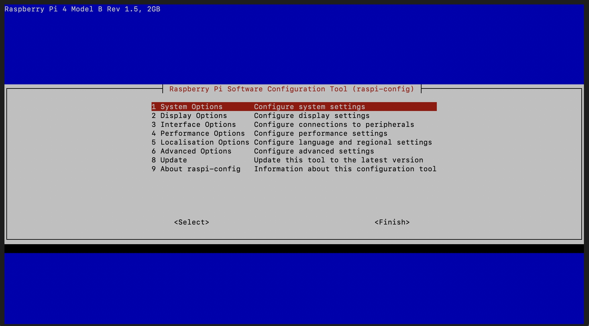
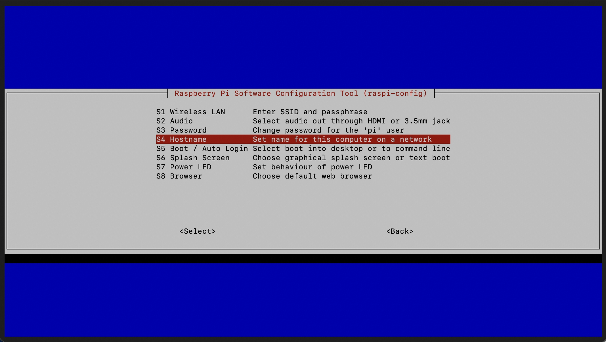
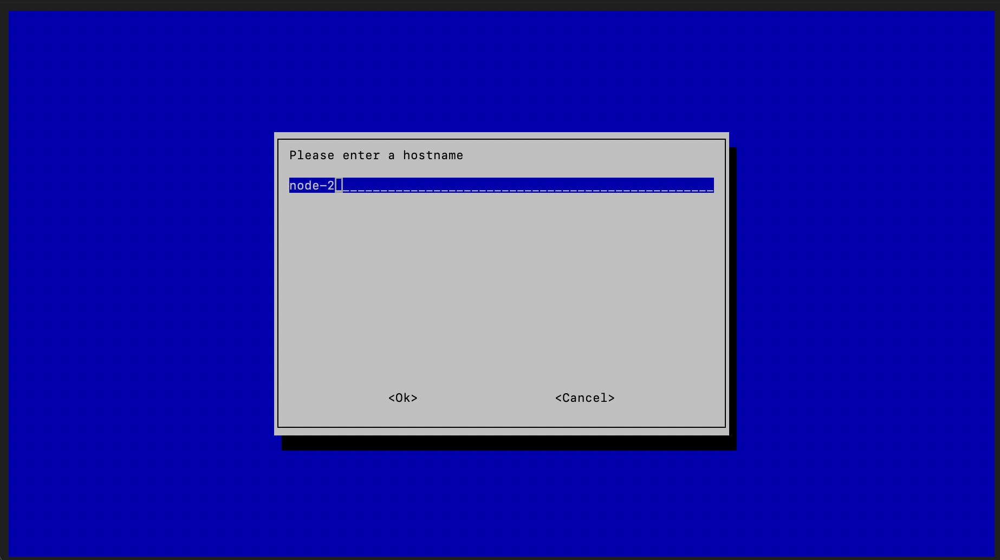
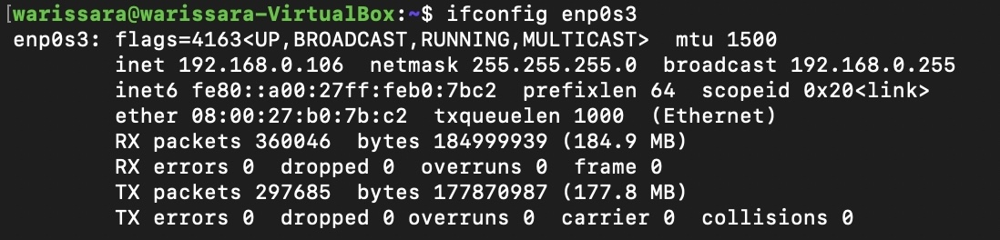
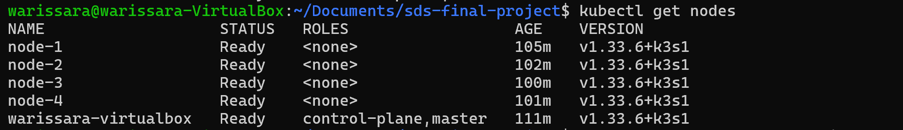
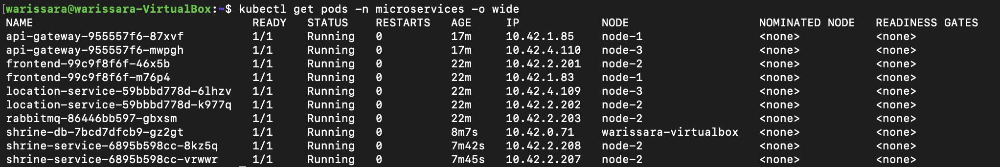

# สาย.mu - Thailand's Shrine Discovery Platform

## 📝 Description

**สาย.mu** (sai.mu) is a digital platform for discovering Thailand's sacred shrines and temples. Built with a modern microservices architecture, it enables both locals and tourists to explore spiritual locations and connect with Thailand's rich cultural and religious heritage.

The platform provides:

- 🗺️ **Location-based shrine discovery** with GPS integration
- 📍 **Comprehensive shrine information** with descriptions and locations

---

# K3s Cluster Setup with Raspberry Pi Workers and VM Master

## **Step 1: Configure Raspberry Pi Settings**

### Set Hostnames

1. Connect to each Pi via SSH

```bash
ssh pi@raspberrypi.local
```

Enter the default password: `raspberry`

2. edit config

```bash
sudo raspi-config
```

3. select `System Options` and the select `S4 Hostname`



4. Set hostname for each node

- `node-1`

- `node-2`
- `node-3`
- `node-4`


### Set CGROUP

K3s requires cgroups (control groups) for resource management such as CPU and memory limits.

```bash
sudo nano /boot/firmware/cmdline.txt
```

Append the following at the end of the same line:
`cgroup_memory=1 cgroup_enable=memory`

---

## **Step 2: Set Static IP Addresses**

Static IPs ensure stable communication inside the K3s cluster.

### **Master (VM)**

Edit netplan configuration:

```bash
sudo nano /etc/netplan/01-network-manager-all.yaml
```

Example configuration:

```yaml
network:
  version: 2
  renderer: NetworkManager
  ethernets:
    enp0s3:
      dhcp4: false
      addresses:
        - <MASTER_NODE_IP>/24
      gateway4: 192.168.0.1
      nameservers:
        addresses: [8.8.8.8, 1.1.1.1]
```

Apply changes:

```bash
sudo netplan apply
sudo systemctl restart k3s
```

### **Workers (Raspberry Pi)**

Set static IP via `nmcli` on each worker:

```bash
sudo nmcli connection modify "Wired connection 1" ipv4.addresses <WORKER_NODE_IP>/24
sudo nmcli connection modify "Wired connection 1" ipv4.gateway 192.168.0.1
sudo nmcli connection modify "Wired connection 1" ipv4.dns "192.168.0.1 8.8.8.8"
sudo nmcli connection modify "Wired connection 1" ipv4.method manual
sudo nmcli connection down "Wired connection 1"
sudo nmcli connection up "Wired connection 1"
```

Change `<WORKER_NODE_IP>` to

- 192.168.0.101
- 192.168.0.102
- 192.168.0.103
- 192.168.0.104

for each worker node

---

## **Step 3: Install K3s**

K3s is a lightweight Kubernetes distribution. Here you install the master node first, then join worker nodes using the master’s token.

### **Master (VM)**

1. Download and install K3s

```bash
curl -sfL https://get.k3s.io | sh -
```

2. changes ownership of the file so your normal user can run `kubectl` without sudo.

```bash
sudo chown $(id -u):$(id -g) /etc/rancher/k3s/k3s.yaml
```

3. Displays the K3s node token.

```bash
sudo cat /var/lib/rancher/k3s/server/node-token
```

save this as `<MASTER_NODE_TOKEN>`

4. Shows network interfaces and IP address.

```bash
ifconfig
```

save this as `<MASTER_NODE_IP>`


### **Workers (Raspberry Pi)**

run this on each pi

```bash
curl -sfL https://get.k3s.io | \
  K3S_TOKEN="<MASTER_NODE_TOKEN>" \
  K3S_URL="https://<MASTER_NODE_IP>:6443" \
  K3S_NODE_NAME="<NODE_HOSTNAME>" \
  sh -
```

Verify nodes:

```bash
kubectl get nodes
```



---

## **Step 4: Set Up Private Docker Registry**

A private Docker registry allows you to store and distribute your own container images inside the local network (faster and no need for Docker Hub).

### **Master (VM)**

Install Docker on the VM:
[https://docs.docker.com/engine/install/ubuntu/](https://docs.docker.com/engine/install/ubuntu/)

```bash
sudo usermod -aG docker $USER
newgrp docker

docker run -d -p 5000:5000 --name registry registry:2

sudo mkdir -p /etc/rancher/k3s/
sudo nano /etc/rancher/k3s/registries.yaml
```

Add:

```yaml
mirrors:
  "<MASTER_NODE_IP>:5000":
    endpoint:
      - http://<MASTER_NODE_IP>:5000
```

Restart K3s:

```bash
sudo systemctl restart k3s
```

---

## **Step 5: Configure Registry on Workers**

### **Workers (Raspberry Pi)**

Workers must trust and connect to the private registry. Since it’s HTTP (not HTTPS), we configure insecure registry access.

```bash
sudo mkdir -p /etc/rancher/k3s
sudo nano /etc/rancher/k3s/registries.yaml
```

Add:

```yaml
mirrors:
  "<MASTER_NODE_IP>:5000":
    endpoint:
      - "http://<MASTER_NODE_IP>:5000"

configs:
  "<MASTER_NODE_IP>:5000":
    tls:
      insecure_skip_verify: true
```

Restart:

```bash
sudo systemctl restart k3s-agent
```

Configure Docker:

```bash
sudo nano /etc/docker/daemon.json
```

Add:

```json
{
  "insecure-registries": ["<MASTER_NODE_IP>:5000"]
}
```

Restart Docker:

```bash
sudo systemctl restart docker
```

---

## **Step 6: Build and Push Images**

### **Worker (One Raspberry Pi)**

Images are built on a Raspberry Pi to ensure ARM64 compatibility. They are then pushed to the master’s private registry so K3s can pull them when deploying apps.

```bash
sudo apt update
sudo apt install docker-compose
docker-compose --version
```

Fix Docker if broken:

```bash
curl -fsSL https://get.docker.com | sh
sudo usermod -aG docker $USER
sudo reboot
```

Build and push:

```bash
chmod +x build-pi.sh
cp .env.example .env
./build-pi.sh
```

Verify registry:

```bash
curl <MASTER_NODE_IP>:5000/v2/_catalog
```

---

## **Step 7: Deploy On Master**

## Choice 1: Deploy with K3S Directly

This script automates deploying all Kubernetes resources. It waits for key components to initialize, applies patches, seeds the databases, and then shows the deployment status.

```bash
./k8s/deploy-vm.sh
```

## Choice 2: Deploy with Terraform

This script automates the full deployment workflow for the Terraform + Kubernetes microservices stack. It performs initialization, planning, deployment, validation, status checks, and optional database seeding.

```bash
./terraform/deploy.sh
```

## Verify deployments

```bash
kubectl get pods -n microservices -o wide
```



**Explain**

- Only **shrine-db** runs on the master VM.
- All other services run on the Raspberry Pi workers.

This is controlled by Kubernetes `nodeSelector`:

- master

```yaml
spec:
  nodeSelector:
    kubernetes.io/hostname: warissara-virtualbox
```

This forces the pod to run only on the VM.

- worker

```yaml
spec:
  nodeSelector:
    kubernetes.io/arch: arm64
```

This ensures pods run only on ARM64 Raspberry Pis.

---

**Verify deployments**

```bash
kubectl get pods -n microservices -o wide
```


**Explain**

- Only **shrine-db** runs on the master VM.
- All other services run on the Raspberry Pi workers.

This is controlled by Kubernetes `nodeSelector`:

- master

```yaml
spec:
  nodeSelector:
    kubernetes.io/hostname: warissara-virtualbox
```

This forces the pod to run only on the VM.

- worker

```yaml
spec:
  nodeSelector:
    kubernetes.io/arch: arm64
```
This ensures pods run only on ARM64 Raspberry Pis.

---

## **Step 8: Delete VM Deployment**

If cleanup is needed.

## Choice 1: Deploy with K3S Directly

```bash
./k8s/delete-vm.sh
```

## Choice 2: Deploy with Terraform

```bash
./terraform/destroy.sh
```
